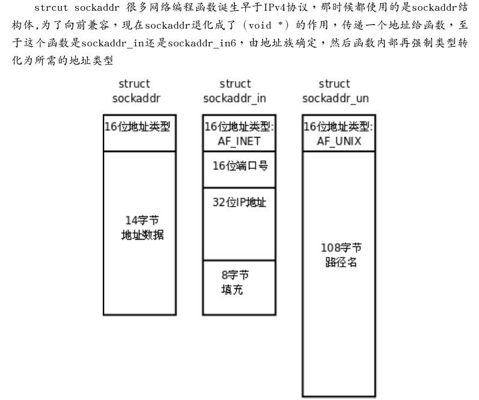

# 网络编程API
### 1.预备知识
**网络字节序**
1.TCP/IP协议规定，网络数据流应采用大端字节序
0x12345678
小端存储：78存储在低地址
大端存储：12存储在低地址
**网络字节序和主机字节序的转换**
```
#include <arpa/inet.h>
uint32_t htonl(uint32_t hostlong);
uint16_t htons(uint16_t hostshort);
uint32_t ntohl(uint32_t netlong);
uint16_t ntohs(uint16_t netshort);
h表示host，n表示network，l(long)表示32位长整数，s(short)表示16位短整数。
如果主机是小端字节序，这些函数将参数做相应的大小端转换然后返回，如果主机是大端字节序，这些函数不做转
换，将参数原封不动地返回。
```
**IP地址转换函数**
192.168.56.101这就是一个字符串，要把这个字符串转换成32位的ip地址
```
#include <arpa/inet.h>
int inet_pton(int af, const char *src, void *dst);
const char *inet_ntop(int af, const void *src, char *dst, socklen_t size);
支持IPv4和IPv6
可重入函数
```
### 2.网络套接字函数
#### 1.socket
```
#include <sys/types.h> /* See NOTES */
#include <sys/socket.h>
int socket(int domain, int type, int protocol);
domain:
AF_INET 这是大多数用来产生socket的协议，使用TCP或UDP来传输，用IPv4的地址
AF_INET6 与上面类似，不过是来用IPv6的地址
AF_UNIX 本地协议，使用在Unix和Linux系统上，一般都是当客户端和服务器在同一台及其上的时候使用
type:
SOCK_STREAM 这个协议是按照顺序的、可靠的、数据完整的基于字节流的连接。这是一个使用最多的socket类
型，这个socket是使用TCP来进行传输。
SOCK_DGRAM 这个协议是无连接的、固定长度的传输调用。该协议是不可靠的，使用UDP来进行它的连接。
SOCK_SEQPACKET 这个协议是双线路的、可靠的连接，发送固定长度的数据包进行传输。必须把这个包完整的
接受才能进行读取。
SOCK_RAW 这个socket类型提供单一的网络访问，这个socket类型使用ICMP公共协议。（ping、traceroute使
用该协议）
SOCK_RDM 这个类型是很少使用的，在大部分的操作系统上没有实现，它是提供给数据链路层使用，不保证数
据包的顺序
protocol:
0 默认协议
返回值：
成功返回一个新的文件描述符，失败返回-1，设置errno
```
socket()打开一个网络通讯端口，如果成功的话，就像open()一样返回一个文件描述符，应用程序可以像读写文件一样用read/write在网络上收发数据，如果socket()调用出错则返回-1。对于IPv4，domain参数指定为AF_INET。对于TCP协议，type参数指定为SOCK_STREAM，表示面向流的传输协议。如果是UDP协议，则type参数指定为SOCK_DGRAM，表示面向数据报的传输协议。protocol参数的介绍从略，指定为0即可。

### 2.bind函数
```
#include <sys/types.h> /* See NOTES */
#include <sys/socket.h>
int bind(int sockfd, const struct sockaddr *addr, socklen_t addrlen);
sockfd：
socket文件描述符
addr:
构造出IP地址加端口号
addrlen:
sizeof(addr)长度
返回值：
成功返回0，失败返回-1, 设置errno
```
bind函数的第二个参数是由于历史原因决定的，其实完全可以写成void*类型，然后根据前16为类决定是哪一类的地址。




服务器程序所监听的网络地址和端口号通常是固定不变的，客户端程序得知服务器程序的地址和端口号后就可以向服务器发起连接，因此服务器需要调用bind绑定一个固定的网络地址和端口号。bind()的作用是将参数sockfd和addr绑定在一起，使sockfd这个用于网络通讯的文件描述符监听addr所描述的地址和端口号。前面讲过，struct sockaddr *是一个通用指针类型，addr参数实际上可以接受多种协议的sockaddr结构体，而它们的长度各不相同，所以需要第三个参数addrlen指定结构体的长度。如：
```
struct sockaddr_in servaddr;
bzero(&servaddr, sizeof(servaddr));
servaddr.sin_family = AF_INET;
servaddr.sin_addr.s_addr = htonl(INADDR_ANY);//INADDR_ANY表示本机的任意的ip地址，可能有好几个网卡。
servaddr.sin_port = htons(8000);
```
首先将整个结构体清零，然后设置地址类型为AF_INET，网络地址为INADDR_ANY，这个宏表示本地的任意IP地址，因为服务器可能有多个网卡，每个网卡也可能绑定多个IP地址，这样设置可以在所有的IP地址上监听，直到与某个客户端建立了连接时才确定下来到底用哪个IP地址，端口号为8000。

### 3.listen：不要从字面意思理解，这个listen的意思是socket文件描述符去具备监听的能力。
```
#include <sys/types.h> /* See NOTES */
#include <sys/socket.h>
int listen(int sockfd, int backlog);
sockfd:
socket文件描述符
backlog:
排队建立3次握手队列和刚刚建立3次握手队列的链接数和(内核维护的两个队列)
listen函数后面维护了两个队列，一个是完成3次握手的队列，一个是未完成3次握手的队列。，当调用accept函数时，就是从已连接的队列中取出一个已经完成3次握手的连接。
```
典型的服务器程序可以同时服务于多个客户端，当有客户端发起连接时，服务器调用的accept()返回并接受这个连接，如果有大量的客户端发起连接而服务器来不及处理，尚未accept的客户端就处于连接等待状态，listen()声明sockfd处于监听状态，并且最多允许有backlog个客户端处于连接待状态，如果接收到更多的连接请求就忽略。listen()成功返回0，失败返回-1。

### 4.accept函数
```
#include <sys/types.h> /* See NOTES */
#include <sys/socket.h>
int accept(int sockfd, struct sockaddr *addr, socklen_t *addrlen);
sockdf:
socket文件描述符
addr:
传出参数，返回链接客户端地址信息，含IP地址和端口号
addrlen:
传入传出参数（值-结果）,传入sizeof(addr)大小，函数返回时返回真正接收到地址结构体的大小
返回值：
成功返回一个新的socket文件描述符，专门用于和客户端通信，失败返回-1，设置errno

```
**为什么要产生新的socket呢**
原来的socket还要处理请求连接的。
三方握手完成后，服务器调用accept()接受连接，如果服务器调用accept()时还没有客户端的连接请求，就阻塞等待直到有客户端连接上来。addr是一个传出参数，accept()返回时传出客户端的地址和端口号。addrlen参数是一个传入传出参数（value-resultargument），传入的是调用者提供的缓冲区addr的长度以避免缓冲区溢出问题，传出的是客户端地址结构体的实际长度（有可能没有占满调用者提供的缓冲区）。如果给addr参数传NULL，表示不关心客户端的地址。

### 5.客户端的connect函数
```
#include <sys/types.h> /* See NOTES */
#include <sys/socket.h>
int connect(int sockfd, const struct sockaddr *addr, socklen_t addrlen);
sockdf:
socket文件描述符
addr:
传入参数，指定服务器端地址信息，含IP地址和端口号
addrlen:
传入参数,传入sizeof(addr)大小
返回值：
成功返回0，失败返回-1，设置errno
```
客户端需要调用connect()连接服务器，connect和bind的参数形式一致，区别在于bind的参数是自己的地址，而connect的参数是对方的地址。connect()成功回0，出错返回-1。

### 6.一个简单的服务器回射函数
server.c
```
#include <unistd.h>
#include <sys/types.h>
#include <sys/socket.h>
#include <netinet/in.h>
#include <arpa/inet.h>
#include <stdlib.h>
#include <stdio.h>
#include <errno.h>
#include <string.h>

#define ERR_EXIT(m) \
	do \
	{ \
		perror(m); \
		exit(EXIT_FAILURE); \
	}while(0)
int main(void)
{
	int listenfd;
	if ((listenfd = socket(PF_INET, SOCK_STREAM, IPPROTO_TCP)) < 0)
		ERR_EXIT("socket");

	struct sockaddr_in servaddr;
	memset(&servaddr, 0, sizeof(servaddr));
	servaddr.sin_family = AF_INET;
	servaddr.sin_port = htons(5188);

	//三种方式设置ip地址
	servaddr.sin_addr.s_addr = htonl(INADDR_ANY);//表示本机的任意地址
	/*servaddr.sin_addr.s_addr = inet_addr("127.0.0.1");*/
	/*inet_aton("127.0.0.1, &servaddr.sin_addr");*/
	if ( bind(listenfd, (struct sockaddr *)&servaddr, sizeof(servaddr)) < 0 )
		ERR_EXIT("bind");

	/*主动套接字是来发起连接*/
	if (listen(listenfd, SOMAXCONN) < 0)//一旦调用了这个函数就变成了被动套接字（接受连接）
		ERR_EXIT("listen");

	struct sockaddr_in peeraddr;//对方的地址长度
 	socklen_t peerlen = sizeof(peeraddr);
	int conn = 0;//主动套接字
	//这里少加了一个括号，调试了好长时间
	if ((conn = accept(listenfd, (struct sockaddr *)&peeraddr, &peerlen)) < 0 )
		ERR_EXIT("accept");

	char recvbuf[1024];
	while(1)
	{
		memset(recvbuf , 0, sizeof(recvbuf));
		int ret = read(conn, recvbuf, sizeof(recvbuf));
		if (ret < 0)
		{
			ERR_EXIT("read");
		}

		fputs(recvbuf, stdout);
		write(conn, recvbuf, ret);
	}
	close(listenfd);
	close(conn);
	return 0;
}

```
client.c
```
#include <unistd.h>
#include <sys/types.h>
#include <sys/socket.h>
#include <netinet/in.h>
#include <arpa/inet.h>
#include <stdlib.h>
#include <stdio.h>
#include <errno.h>
#include <string.h>

#define ERR_EXIT(m) \
	do \
	{\
		perror(m);\
		exit(EXIT_FAILURE); \
	}while(0)
int main(void)
{
	int sock;
	if ((sock = socket(PF_INET, SOCK_STREAM, IPPROTO_TCP)) < 0)
		ERR_EXIT("socket");

	struct sockaddr_in servaddr;
	memset(&servaddr, 0, sizeof(servaddr));
	servaddr.sin_family = AF_INET;
	servaddr.sin_port = htons(5188);

	//三种方式设置ip地址
	servaddr.sin_addr.s_addr = inet_addr("127.0.0.1");
	if ( connect(sock, (struct sockaddr *)&servaddr, sizeof(servaddr)) < 0)
		ERR_EXIT("connect");

	char sendbuf[1024] = "aaa";
	char recvbuf[1024] = {0};
	while(fgets(sendbuf, sizeof(sendbuf), stdin) != NULL)
	{
		write(sock, sendbuf,  strlen(sendbuf));
		read(sock, recvbuf, sizeof(recvbuf));

		fputs(recvbuf, stdout);
		memset(recvbuf, 0, sizeof(recvbuf));
		memset(sendbuf, 0, sizeof(sendbuf));
	}
	close(sock);
	return 0;
}

```
