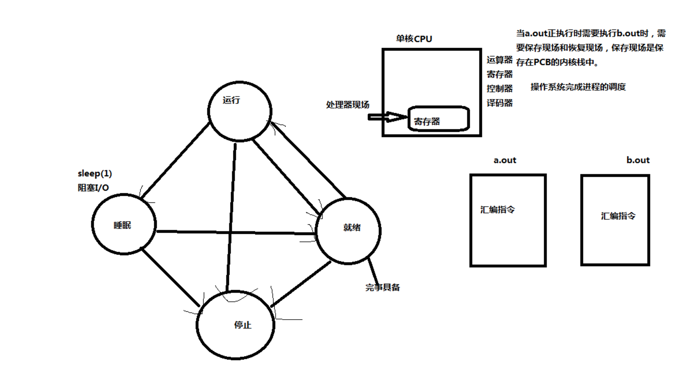
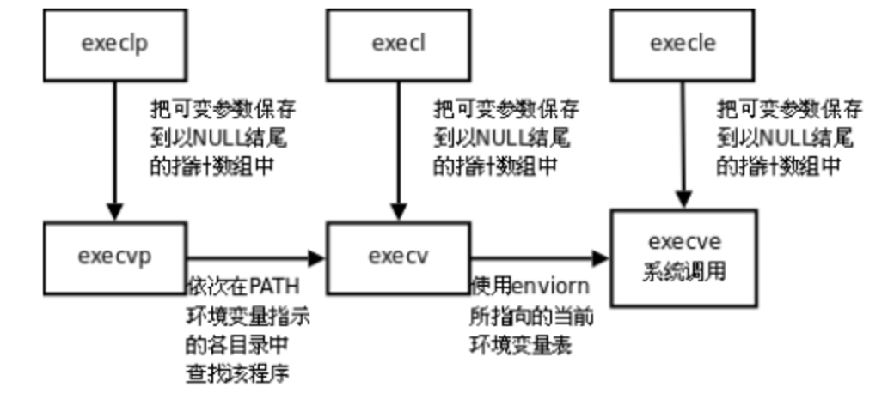
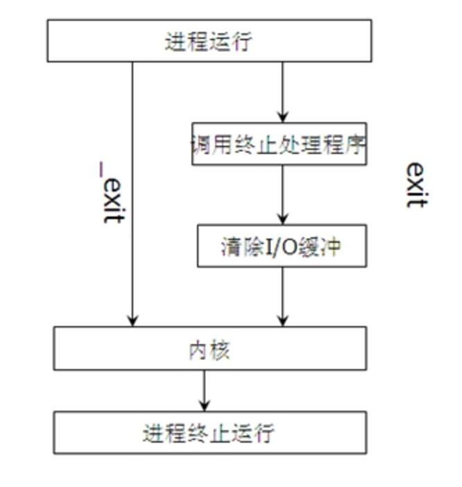

# linux系统编程-进程基本概念

什么是程序
>  程序是完成特定任务的一系列指令集合。

什么是进程
> 从用户的角度来看进程是程序的一次执行过程
从操作系统的核心来看，进程是操作系统分配的内存、CPU时间片等资源的基本单位。
进程是资源分配的最小单位
每一个进程都有自己独立的地址空间与执行状态。
像UNIX这样的多任务操作系统能够让许多程序同时运行，每一个运行着的程序就构成了一个进程

### 2.进程的三种状态



### 3.fork子进程
1.进程1次调用2次返回的本质是：Linux内核让两个进程，在各自的内存空间的时候返回。
2.都copy了什么：代码段，堆栈段，数据段，进程控制块(PCB)

### 4.僵尸进程和孤儿进程
* 1.如果父进程先退出，子进程还没退出那么子进程的父进程将变为init进程。（注：任何一个进程都必须有父进程）
* 2.如果子进程先退出，父进程还没退出，那么子进程必须等到父进程捕获到了子进程的退出状态才真正结束，否则这个时候子进程就成为僵进程。
* 3.孤儿进程:如果父亲进程先结束，子进程会托孤给1号进程.
* 4.避免僵尸进程的方法:signal(SIGCHLD, SIG_IGN);  告诉linu内核这个孩子我不管，不收尸体。

```
//僵尸进程和孤儿进程
#include <stdio.h>
#include <stdlib.h>
#include <signal.h>

int main (void)
{
	pid_t pid;
	//signal ( SIGCHLD, SIG_IGN );/*这是一种避免僵尸进程的方法*/

	pid = fork();
	if ( pid== -1 )
	{
		perror( "title" );
		return -1;
	}
	if ( pid > 0 )
	{
		printf( "parent:pid:%d\n",getpid() );
		sleep(100);
	}
	else if ( pid == 0 )
	{
		printf( "parent:pid:%d\n",getppid() );
	}
}
```
### 5.fork 之后的文件描述符
两个进程都写到了一个文件中
```
#include <sys/types.h>
#include <unistd.h>

#include <stdlib.h>
#include <stdio.h>
#include <string.h>

#include <signal.h>
#include <errno.h>
#include <signal.h>

#include <sys/stat.h>
#include <fcntl.h>
//需要close两次
int main()
{
	pid_t pid;
	int fd = 0;
	signal(SIGCHLD, SIG_IGN);
	printf("before fork pid:%d\n",getpid());
	fd = open("./1.txt", O_RDWR);
	if (fd == -1)
	{
			perror("open");
			return -1;
	}

	pid = fork();
	if (pid > 0)
	{
		write(fd, "parent", 6);
		close (fd);
	}
	else if (pid == 0)
	{
		write(fd, "child", 5);
		close(fd);
	}
	printf("fork end\n");
}

```
### 6.fork和vfork
1）在fork还没实现copy on write之前。Unix设计者很关心fork之后立刻执行exec所造成的地址空间浪费，所以引入了vfork系统调用。

2）vfork有个限制，子进程必须立刻执行_exit或者exec函数。

即使fork实现了copy on write，效率也没有vfork高，但是我们不推荐使用vfork，因为几乎每一个vfork的实现，都或多或少存在一定的问题。

结论：
1：fork子进程拷贝父进程的数据段;Vfork子进程与父进程共享数据段；
2：fork父、子进程的执行次序不确定;Vfork：子进程先运行，父进程后运行；

### 7.execve函数组，会覆盖当前进程的代码段数据段等。
```
#include <unistd.h>
extern char **environ;
int execl(const char *path, const char *arg, …);
int execlp(const char *file, const char *arg, …); PATH
int execle(const char *path, const char *arg,
           …, char * const envp[]);
int execv(const char *path, char *const argv[]);
int execvp(const char *file, char *const argv[]);
```
>*  path参数表示你要启动程序的名称包括路径名
 arg参数表示启动程序所带的参数
返回值:成功返回0,失败返回-1

>*  execl，execlp，execle（都带“l”）的参数个数是可变的，参数以一个空指针结束。
 execv和execvp的第二个参数是一个字符串数组，新程序在启动时会把在argv数组中给定的参数传递到main
这些函数通常都是用execve实现的，这是一种约定俗成的做法，并不是非这样不可。

>*  名字最后一个字母是“p”的函数会搜索PATH环境变量去查找新程序的可执行文件。如果可执行文件不在PATH定义的路径上，就必须把包括子目录在内的绝对文件名做为一个参数传递给这些函数

>* 总结：l代表可变参数列表，p代表在path环境变量中搜索file文件。envp代表环境变量

```
int main(void)
{
//演示程序被完全替换
//替换以后，pid不会发生变化
//注意 printf后的\n不能忘记，不然main函数打印不出来
printf(“main getpid: %d\n”, getpid());
//execlp(“ls”, “ls”, “-lt”,  NULL);
int ret = execlp(“./testpid2”, NULL, NULL);
if (ret == -1)
{
perror(“ERR: “);
}
printf(“fork after….\n”);
return 0;
}
```
有关环境变量
```
#include <stdio.h>
#include <unistd.h>

int main(void)
{
    char *argvv[] = {"ls", "-l", NULL};
    printf("hello\n");
    execv("/bin/ls", argvv);
    printf("world\n");
    return 0;
}
execvp是对应的第一个参数不用写全路径，会去PATH环境变量中寻找。
execle和execve是可以替换掉环境变量。
事实上，只有execve是真正的系统调用，其它五个函数最终都调用execve，所以execve在man手册第2节，其它函数在man手册第3节。这些函数之间的关系如下图所示。

```



### 8.进程的终止方式
进程终止的5种方式：
* 1.正常退出
* 2.从main函数返回
* 3.调用exit
* 4.调用_exit
* 5.异常退出（调用abort   产生SIGABOUT信号；由信号终止  ctrl+c SIGINT）

#### exit和_exit的区别：


区别1：
```
区别1：清空缓冲区的操作
int main(void)
{
printf("hello itcast");
//return 0;
//exit(0);是c库函数
fflush(stdout);
_exit(0);//系统调用
}
```
区别2:exit会调用终止处理程序
```
 atexit可以注册终止处理程序，ANSI C规定最多可以注册32个终止处理程序。
 终止处理程序的调用与注册次序相反
 man atexit
```
总结：
```
总结exit与_exit区别
1）_exit是一个系统调用，exit是一个c库函数
2）exit会执行清楚I/O缓存
3）exit会执行调用终止处理程序
```
